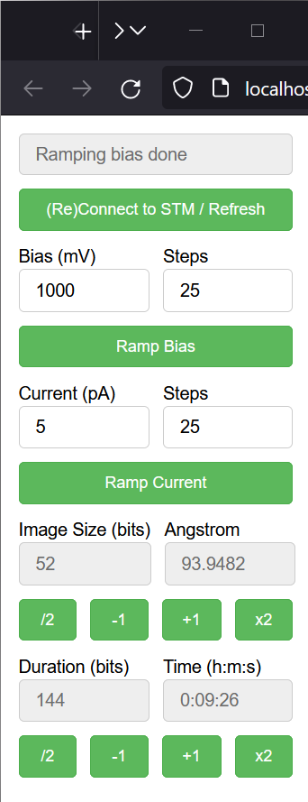

# Py-Createc


This is a Python interface package for the [CreaTec scanning probe microscope (STM)](https://www.createc.de/LT-STMAFM). This package serves two main purposes:

#### 1. **Python Interface for Createc STM**: 
It includes a wrapper class (`createc.CreatecWin32`) that interfaces with the Createc STM software. This component offers enhanced access to all standard remote operations, with additional custom methods such as `ramp_bias_mV` and `ramp_current_pA`, extending the capabilities beyond the default functions.

#### 2. **File Management and Analysis Tools**: 
Besides interfacing with the STM, Py-Createc features a suite of classes for handling and analyzing the data files (.dat, .vert, etc.) generated by the STM. These tools, developed independently, allow for efficient and effective management of STM data, offering functionalities such as image instance creation and more.

The online documentation can be found [here](https://py-createc.readthedocs.io).

## Installation

In the root directory, run
```pip install -e .```


## Quickstart

**Interfacing with Createc STM**

```
import createc
stm = createc.CreatecWin32()
stm.stmbeep()  # Playing the testing beep sound on the STM constroller
stm.ramp_bias_mV(1000)  # Ramping bias to 1V
```
**Handling STM Data Files**

Furthermore, several classes are available to to read ``.dat``, ``.vert`` files etc.
For example, an image instance can be created by:

```
import createc
image_file = createc.DAT_IMG('path/to/filename.dat')
```

## File Structure

```
.
+-- createc  # The main modules
|   +-- Createc_pyCOM  
|   |  +-- CreatecWin32  # The wrapper class that expands the scope of default Createc functions. The .ramp_bias_mV and .ramp_current_pA methods are in here
|   |
|   +-- Createc_pyFile  # The unified Createc file classes
|      +-- GENERIC_FILE  # The parent file class
|      |  +-- DAT_IMG(GENERIC_FILE)  # The child class for reading .dat files
|      |  +-- VERT_SPEC(GENERIC_FILE)  # The child class for reading .vert files
|      +-- GRID_SPEC  # A standalone class for .gridspec files
|
+-- examples
|   +-- map  # An applet to map out a bunch of images according to their locations/angles, useful for offline images-viewing
|   +-- osc  # An applet to show real time STM signals, the channels can be easily configured inside the script
|   +-- utility  # A helper applet for the STM operation, The .ramp_bias_mV and .ramp_current_pA methods are in here. (see screenshots below)
|
+-- tests
+-- doc
+-- LICENSE
+-- README
```

## More Elaborate Examples

The [examples folder](https://github.com/chenxu2394/py_createc/tree/main/examples) contains useful scripts to communicate with the STM. These scripts demonstrate the advanced applications of the Py-Createc package.

#### 1. Oscilloscope Example (`./examples/osc/oscilloscope.py`)

This script displays the temperatures of the STM in an oscilloscope format. Users can view the value and its timestamp by hovering the cursor over the curves. It's also configurable to display other signals.


#### 2. Image Mapping Applet (`./examples/map/map.py`)

This helper applet facilitates piecing together images scanned at different locations. Additionally, it enables communication with the STM through a 'Connect to STM' feature, synchronizing the applet's tip position with that of the STM.


#### 3. STM Utility Tool (`./examples/utility/stm_tool.py`)

With this utility, changing STM parameters is simplified to a single click, enhancing user convenience and efficiency.


