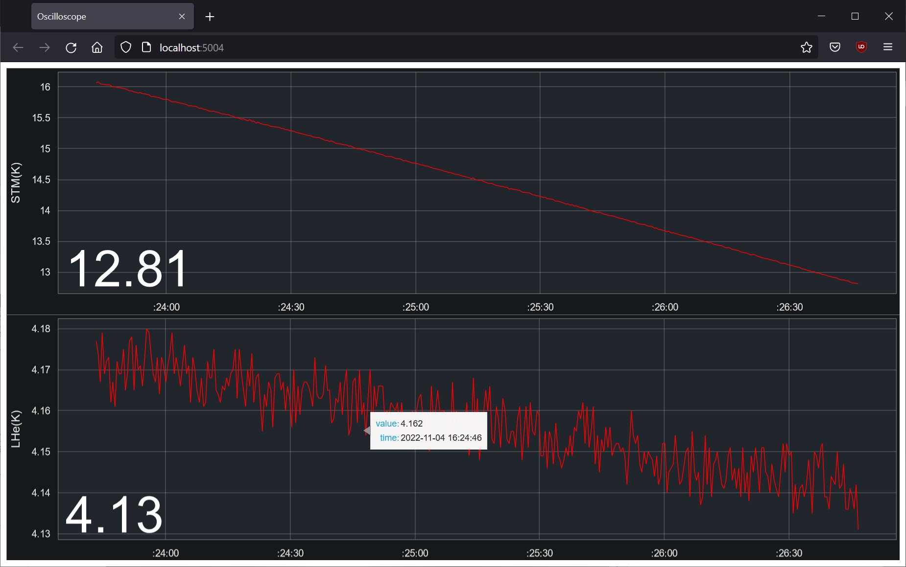
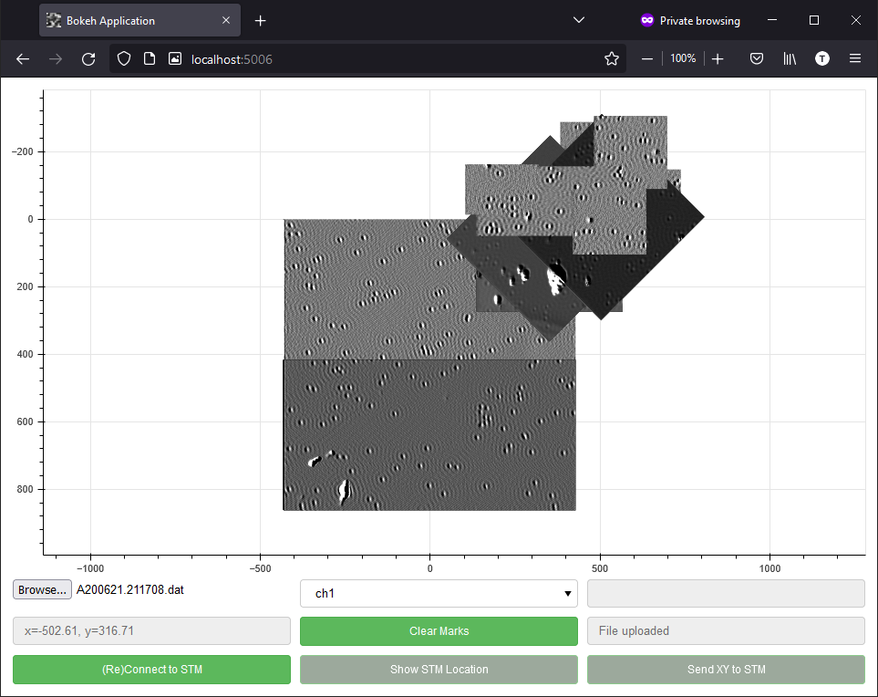

Py-Createc
==========

Modules and example scripts to interface with the `Createc STM <https://www.createc.de/LT-STMAFM>`_.

The online documentation can be found `here <https://py-createc.readthedocs.io>`_.

Installation
------------

Installation of the package can be done through `PIP <https://pip.pypa.io>`_:

``pip install createc``

Quickstart
----------

:py:class:`createc.CreatecWin32` is a wrapper class to interface with the Createc software.
It provides access to all remote operations that can be found at the `stm-wiki <http://archive.today/I7Aw0>`_.
In addition, there are several custom methods available, such as :py:meth:`createc.CreatecWin32.ramp_bias_mV` and :py:meth:`createc.CreatecWin32.ramp_current_pA`, etc.

Here is an example that plays the testing beep sound on the STM:

.. code-block:: python

   import createc
   stm = createc.CreatecWin32()
   stm.stmbeep()

Furthermore, several classes are available to to read ``.dat``, ``.vert`` files etc.
For example, an image instance can be created by:

.. code-block:: python

   import createc
   image_file = createc.DAT_IMG('path/to/filename.dat')

File Structure
--------------

.. code-block::

   .
   +-- createc  # The main modules
   |   +-- Createc_pyCOM  
   |   |  +-- CreatecWin32  # The wrapper class that expands the scope of default Createc functions. The .ramp_bias_mV and .ramp_current_pA methods are in here
   |   |
   |   +-- Createc_pyFile  # The unified Createc file classes
   |      +-- GENERIC_FILE  # The parent file class
   |      |  +-- DAT_IMG(GENERIC_FILE)  # The child class for reading .dat files
   |      |  +-- VERT_SPEC(GENERIC_FILE)  # The child class for reading .vert files
   |      +-- GRID_SPEC  # A standalone class for .gridspec files
   |
   +-- examples
   |   +-- map  # An applet to map out a bunch of images according to their locations/angles, useful for offline images-viewing
   |   +-- osc  # An applet to show real time STM signals, the channels can be easily configured inside the script
   |   +-- utility  # A helper applet for the STM operation, The .ramp_bias_mV and .ramp_current_pA methods are in here. (see screenshots below)
   |
   +-- tests
   +-- doc
   +-- LICENSE
   +-- README

More elaborate examples
-----------------------

The `examples folder <https://github.com/chenxu2394/py_createc/tree/main/examples>`_ contains useful scripts to communicate with the STM.
These scripts show off the more advanced features of the Py-Createc package.

Here is an STM helper applet from ``./examples/utility/stm_tool.py``

.. figure:: ../doc/stmutil.png

Below is an oscilloscope from ``./examples/osc/oscilloscope.py``, the channel can be configured inside the example code

And below is another helper applet from ``./examples/map/map.py``

API Documentation
-----------------

Finally, there is the comprehensive `API documentation <https://py-createc.readthedocs.io/en/latest/api.html#api-documentation>`_

Citation
--------

Author
------
Chen Xu <cxu.self@gmail.com>
